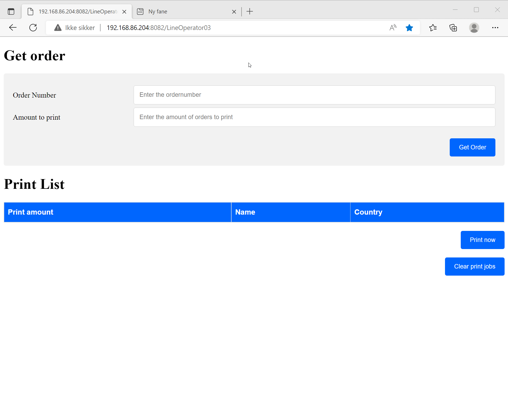
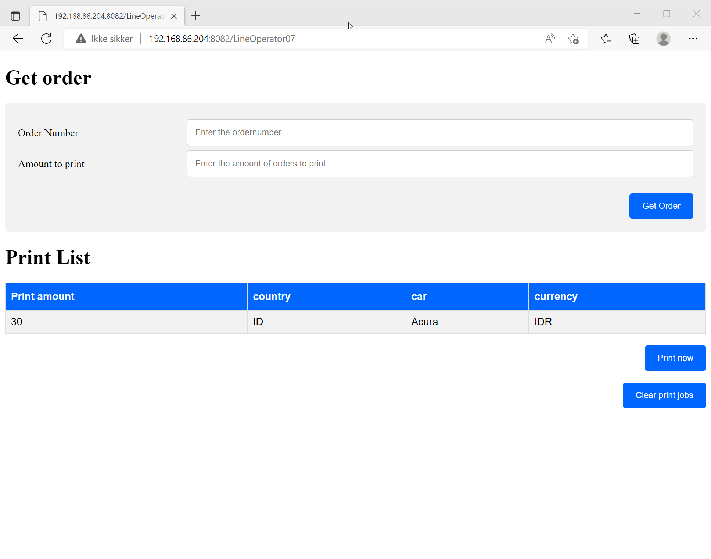

# Print labels from any web enabled device
***Various data integration***

With this website users can easily grab data from various places including
* .TXT files
* .CSV Files
* SQL Data (Requires SQLCMD or other modules)
* EXCEL Data (Requires module)
* SharePoint Data (Probably requires modules too)
a csv file, sql, excel file (requires module) and other kind of data to enable easy label printing

To create a .csv file on a server that triggers a label print job

***Easy to customize***

PWSH-LabelWebInterface is an example that shows how easy it is using powershell and DOT NET to create a frontend for users to print labels

***Use any web enabled device***

Print labels on any device with a web interface, e.g iPads, Chromebooks, Windows, other benefits include centralised management and quick PC setup

***Why use this?***

Benefits include
* Centralised label print management
* Use print servers, no need to install print drivers on every line operater PC
* Extra redundancy, in case a PC goes down, employee's can print from any web enabled device
* Easy customizeable, the company may have add ons or tracking, integrating should probably be easier from a centralised server rather than installing on every PC
* A langauge IT workers understand, No need to use software from the early 2000's that takes hours to setup
* Uses dot net, powershell, html

# Requirements

**Windows**

* Windows 10 or later
* Label software that support file triggers

**Linux**

* PWSH
[Link](https://learn.microsoft.com/en-us/powershell/scripting/install/installing-powershell-on-linux?view=powershell-7.2)
* .DOT NET
[Link](https://learn.microsoft.com/en-us/dotnet/core/install/linux)
* Label software that support file triggers

# Before you try
I would recommend you use [Universal Dashboard](https://ironmansoftware.com/powershell-universal) as setting this up is way faster, and probably way more secure and centralised

If the label software used is paid, please read the license agreements, for some software the license may be based on number of computers and not number of printers or users

# How to use
```
cd 'PathTo\MainFolder'
Start 'Start-LabelWebServer.ps1

```
# Showcase




## Credits
[Jacob Ochoa](https://gist.github.com/jakobii) for giving a great example on how to start a webserver using pwsh
https://gist.github.com/jakobii/429dcef1bacacfa1da254a5353bbeac7

[Adam Driscoll](https://github.com/adamdriscoll) for inspiration

W3Schools for all the amazing HTML examples

Reddit, spiceworks and other places where amazing people that share their work, suggestions and examples 


